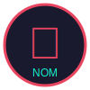

# NOM-GAMEZ 🎰

Provably fair crypto-gaming and prediction market platform built on Zenon Network.



## Features

### 🎮 Games
- **Dice Roll:** Adjustable win chance, instant payouts
- **Slots:** Classic slot machine with crypto rewards
- **Space Shooter:** Provably fair deterministic gameplay (replayable for verification)

### 📈 Prediction Markets
- Atomic settlement with proper payouts
- System-generated and user-created markets
- Real-time odds based on pool sizes
- 2% platform fee on winning pools

### 🔒 Security & Fairness
- Provably fair game logic with seed commitment
- Replayable deterministic shooter game
- Atomic market settlement (rollback on failure)
- IP/address rate limits for free play
- Zenon and BTC wallet integration

### 🐳 Infrastructure
- One-command startup with Docker + docker-compose
- GitHub Actions CI/CD (tests, linting, Docker build)
- Modern React + Vite frontend
- Responsive design for mobile/desktop

## Quick Start

### Prerequisites
- Node.js 18+
- Docker & Docker Compose (optional)
- Zenon wallet (for gameplay)
- BTC wallet (for deposits/withdrawals)

### Local Development
1. Clone the repo:
   ```bash
   git clone https://github.com/openmac0815/nom-gamez.git
   cd nom-gamez
   ```

2. Set up backend:
   ```bash
   cd nomgamez-backend
   cp .env.example .env
   # Edit .env with your wallet seeds and API keys
   npm install
   npm run dev
   ```

3. Set up frontend:
   ```bash
   cd ../frontend
   npm install
   npm run dev
   ```

### Docker Deployment
```bash
# Copy backend .env
cp nomgamez-backend/.env.example nomgamez-backend/.env
# Edit .env with your secrets

# Start all services
docker-compose up -d

# Frontend: http://localhost:8080
# Backend API: http://localhost:3001
```

## Configuration

### Backend Config (`nomgamez-backend/config.js`)
- `games`: Enable/disable individual games, adjust payout multipliers
- `market`: Market creation rules, fee percentage, position limits
- `freePlay`: Free play settings, win probability, rate limits
- `enableUnsafeMarkets`: Set to `true` (atomic settlement implemented)
- `enableUnsafeFreeplay`: Set to `true` (rate limits implemented)

### Environment Variables (`.env`)
Copy `nomgamez-backend/.env.example` to `.env` and fill in:
- `PLATFORM_SEED`: Your Zenon platform wallet seed (keep secret!)
- `PLATFORM_ADDRESS`: Corresponding Zenon address
- `BTC_DEPOSIT_ADDRESS`: Your BTC deposit address
- `ZNN_NODE_URL`: Zenon node URL (default: wss://node.zenon.fun:35998)

## Documentation

### JSDoc
All new/modified code includes JSDoc comments. To generate docs:
```bash
cd nomgamez-backend
npm install -g jsdoc
jsdoc -c jsdoc.conf.json
```

### Changelog
See [CHANGELOG.md](CHANGELOG.md) for version history.

## Testing
```bash
cd nomgamez-backend
npm test  # Runs all tests including smoke tests
```

## Wallet Integration
- **Zenon:** Uses `znn-typescript-sdk` for wallet generation and transactions
- **BTC:** Supports BTC wallet connect for deposits and payouts
- Frontend components for seamless wallet connection

## API Endpoints

### Public Endpoints
- `GET /health` - Health check
- `GET /api/games` - List available games
- `GET /api/markets/open` - List open prediction markets
- `POST /api/games/:id/play` - Play a game
- `POST /api/markets/:id/position` - Take market position

### Admin Endpoints (require `ADMIN_TOKEN`)
- `GET /admin/treasury` - Treasury balance/liability data
- `GET /admin/stats` - Platform statistics
- `POST /admin/config` - Update runtime config
- `GET /admin/markets/due-for-resolution` - Markets needing resolution

### Treasury Dashboard
Admin UI available at `/admin/treasury` (requires admin wallet connection).
See [TreasuryDashboard](frontend/src/components/TreasuryDashboard.jsx) component.

## License
MIT License (see LICENSE file)

## Contact
- GitHub: [openmac0815/nom-gamez](https://github.com/openmac0815/nom-gamez)
- Issues: [Report a bug](https://github.com/openmac0815/nom-gamez/issues)
